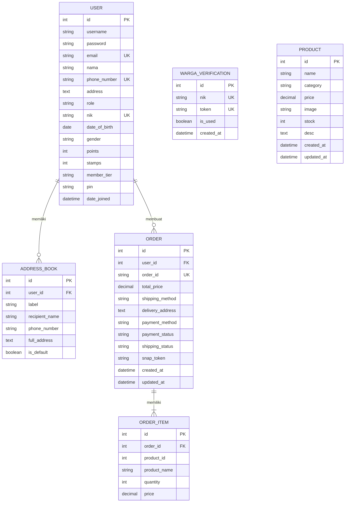
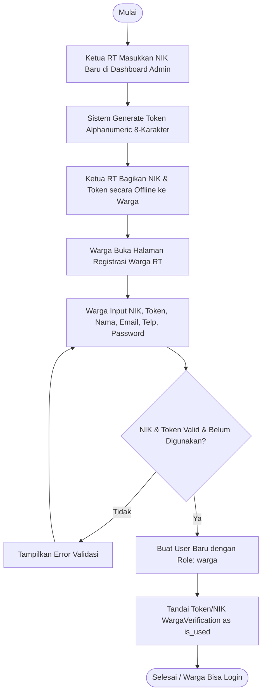
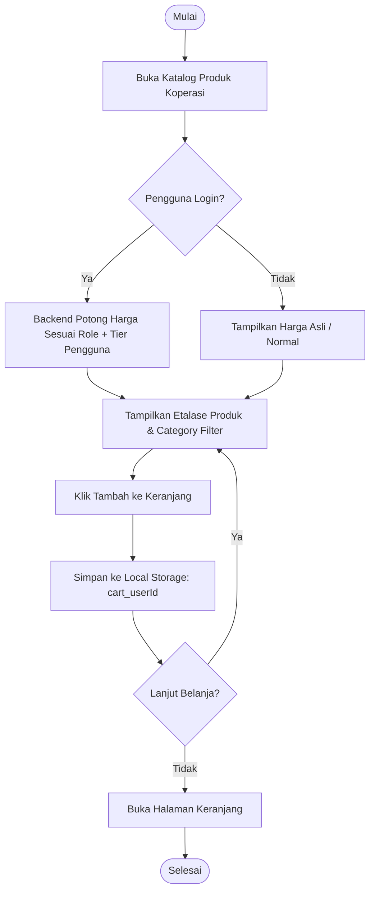
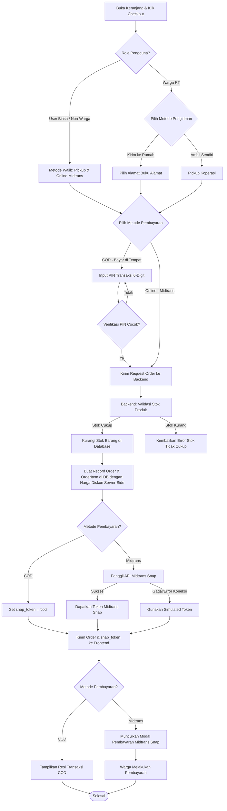

# 🛒 KopeRT - Aplikasi Koperasi RT

Aplikasi **Koperasi RT (KopeRT)** adalah platform e-commerce dan loyalitas warga tingkat Rukun Tetangga (RT) yang mengintegrasikan sistem belanja kebutuhan pokok, manajemen alamat pengiriman, loyalitas digital (A-Poin & Digital Stamps), verifikasi PIN transaksi, serta gerbang pembayaran online otomatis menggunakan Midtrans.

Proyek ini terbagi menjadi dua bagian utama:
*   [**Backend (Django REST Framework)**](file:///c:/Kuliah/Semester%204/Rekayasa%20Perangkat%20Lunak/UAS/backend/)
*   [**Frontend (Next.js & TypeScript)**](file:///c:/Kuliah/Semester%204/Rekayasa%20Perangkat%20Lunak/UAS/frontend/)

---

## 🏗️ Arsitektur Teknologi

Sistem menggunakan arsitektur **Decoupled Client-Server**:
1.  **Backend (Django REST Framework)**:
    *   **Bahasa/Framework**: Python 3 & Django 6.0.5 + DRF
    *   **Database**: MySQL (`koperasi_rt`)
    *   **Autentikasi**: JWT (JSON Web Tokens) melalui `djangorestframework-simplejwt`
    *   **Integrasi Pembayaran**: Midtrans Snap API (Sandbox) & Webhook untuk notifikasi status pembayaran
    *   **Logika Bisnis**: Penghitungan diskon berbasis peran, sistem loyalitas (A-Poin & Stamps) khusus warga RT, serta klasifikasi tier keanggotaan berdasarkan total nominal transaksi sukses 30 hari terakhir.
2.  **Frontend (Next.js & React)**:
    *   **Bahasa/Framework**: TypeScript, Next.js (App Router), React
    *   **Desain & UI**: TailwindCSS dan Custom CSS (Neumorphism & Glassmorphism) untuk efek transisi dan tampilan premium.
    *   **Manajemen Sesi & State**: 
        *   **`sessionStorage`**: Digunakan untuk menyimpan token akses JWT dan profil pengguna guna mengisolasi sesi masuk per tab browser. Ini memungkinkan satu browser (satu device) dapat masuk menggunakan beberapa akun berbeda secara bersamaan.
        *   **`localStorage`**: Digunakan untuk menyimpan data keranjang belanja (`cart_<userId>`) agar persisten meskipun tab atau browser ditutup.

---

## 📊 Entity Relationship Diagram (ERD)

Relasi antarentitas dalam basis data digambarkan melalui diagram di bawah ini:

---

## 🗄️ Struktur Tabel Database (`koperasi_rt`)

### 1. Tabel `accounts_user` (Data Pengguna & Loyalitas)
Menyimpan profil akun, peran akses, data loyalitas poin/stamp, tier member, NIK, dan PIN keamanan transaksi.

| Nama Kolom | Tipe Data | Keterangan |
| :--- | :--- | :--- |
| `id` | `INT (PK, Auto Increment)` | ID unik pengguna. |
| `username` | `VARCHAR(150, Unique)` | Username (diisi dengan email saat pendaftaran). |
| `password` | `VARCHAR(128)` | Hash kata sandi akun. |
| `email` | `VARCHAR(254, Unique)` | Alamat email terdaftar. |
| `nama` | `VARCHAR(150)` | Nama lengkap warga. |
| `phone_number` | `VARCHAR(20, Unique)` | Nomor telepon aktif. |
| `address` | `TEXT (Nullable)` | Alamat default. |
| `role` | `VARCHAR(10)` | Peran akun (`admin` / `warga` / `user`). |
| `nik` | `VARCHAR(16, Unique, Nullable)`| Nomor Induk Kependudukan (wajib bagi role `warga`). |
| `date_of_birth`| `DATE (Nullable)` | Tanggal lahir. |
| `gender` | `VARCHAR(2, Nullable)` | Jenis kelamin (`L` / `P`). |
| `points` | `INT` | Jumlah **A-Poin** (Default: 0, khusus `warga`). |
| `stamps` | `INT` | Jumlah **Stamp Digital** (Default: 0, khusus `warga`). |
| `member_tier` | `VARCHAR(15)` | Tingkatan member (`silver`, `gold`, `platinum`). |
| `pin` | `VARCHAR(6, Nullable)` | PIN 6-digit keamanan transaksi COD (khusus `warga`). |

### 2. Tabel `accounts_wargaverification` (Data NIK & Token Pra-Registrasi)
Digunakan oleh Admin untuk memverifikasi kependudukan warga sebelum warga mendaftarkan akun di website.

| Nama Kolom | Tipe Data | Keterangan |
| :--- | :--- | :--- |
| `id` | `INT (PK, Auto Increment)` | ID unik record. |
| `nik` | `VARCHAR(16, Unique)` | NIK warga yang didaftarkan oleh RT secara offline. |
| `token` | `VARCHAR(10, Unique)` | Token registrasi acak 8 karakter alphanumeric (huruf besar & angka). |
| `is_used` | `BOOLEAN` | Status penggunaan token (hanya bisa digunakan sekali saat registrasi). |
| `created_at` | `DATETIME` | Waktu token diterbitkan. |

### 3. Tabel `accounts_addressbook` (Buku Alamat Pengiriman)
Menyimpan daftar alamat pengantar untuk pengiriman barang (khusus role `warga`).

| Nama Kolom | Tipe Data | Keterangan |
| :--- | :--- | :--- |
| `id` | `INT (PK, Auto Increment)` | ID unik alamat. |
| `user_id` | `INT (FK)` | Relasi ke `accounts_user.id`. |
| `label` | `VARCHAR(50)` | Label alamat (misal: "Rumah Utama", "Warung"). |
| `recipient_name`| `VARCHAR(150)` | Nama penerima paket. |
| `phone_number` | `VARCHAR(20)` | Nomor telepon penerima. |
| `full_address` | `TEXT` | Detail alamat pengiriman lengkap. |
| `is_default` | `BOOLEAN` | Menandakan apakah ini alamat pengiriman utama. |

### 4. Tabel `orders_product` (Katalog Barang)
Menyimpan katalog produk kebutuhan yang dijual di koperasi.

| Nama Kolom | Tipe Data | Keterangan |
| :--- | :--- | :--- |
| `id` | `INT (PK, Auto Increment)` | ID unik produk. |
| `name` | `VARCHAR(200)` | Nama barang. |
| `category` | `VARCHAR(100)` | Kategori barang (misal: Sembako, Minyak, Mie Instan). |
| `price` | `DECIMAL(12, 2)` | Harga dasar satuan barang (`original_price`). |
| `image` | `VARCHAR(500)` | Emoji / Icon / Path gambar produk. |
| `stock` | `INT` | Jumlah stok yang tersedia. |
| `desc` | `TEXT (Nullable)` | Keterangan/deskripsi barang. |
| `created_at` | `DATETIME` | Waktu produk ditambahkan. |
| `updated_at` | `DATETIME` | Waktu data produk diperbarui terakhir kali. |

### 5. Tabel `orders_order` (Pesanan Belanja)
Menyimpan data ringkasan transaksi belanja warga.

| Nama Kolom | Tipe Data | Keterangan |
| :--- | :--- | :--- |
| `id` | `INT (PK, Auto Increment)` | ID transaksi internal. |
| `user_id` | `INT (FK)` | Relasi ke `accounts_user.id`. |
| `order_id` | `VARCHAR(50, Unique)` | Kode pemesanan unik (`KOP-YYYYMMDDHHMMSS-RAND`). |
| `total_price` | `DECIMAL(12, 2)` | Total nominal belanja setelah dipotong diskon role & tier. |
| `shipping_method`| `VARCHAR(20)` | Cara pengambilan (`pickup` = Ambil Sendiri, `delivery` = Kirim ke Rumah). |
| `delivery_address`| `TEXT (Nullable)` | Alamat pengiriman jika barang diantar (khusus `warga`). |
| `payment_method`| `VARCHAR(20)` | Metode pembayaran (`midtrans` = Online, `cod` = Bayar di Tempat/COD). |
| `payment_status`| `VARCHAR(20)` | Status pembayaran (`pending`, `paid`, `failed`, `expired`). |
| `shipping_status`| `VARCHAR(20)` | Status pengiriman (`proses`, `siap_diambil`, `sedang_diantar`, `selesai`). |
| `snap_token` | `VARCHAR(255, Nullable)`| Token pembayaran Midtrans Snap. |
| `created_at` | `DATETIME` | Waktu transaksi dibuat. |
| `updated_at` | `DATETIME` | Waktu data transaksi diperbarui. |

### 6. Tabel `orders_orderitem` (Detail Barang Pesanan)
Menyimpan rincian setiap barang yang dibeli pada sebuah pesanan.

| Nama Kolom | Tipe Data | Keterangan |
| :--- | :--- | :--- |
| `id` | `INT (PK, Auto Increment)` | ID item. |
| `order_id` | `INT (FK)` | Relasi ke `orders_order.id`. |
| `product_id` | `INT` | ID produk terdaftar (sebagai referensi). |
| `product_name` | `VARCHAR(150)` | Nama produk saat transaksi dibuat. |
| `quantity` | `INT` | Jumlah barang yang dibeli. |
| `price` | `DECIMAL(12, 2)` | Harga satuan produk setelah dipotong diskon saat dibeli. |

---

## 🔄 Alur Program (Workflows & Flowcharts)

### 1. Alur Registrasi Warga RT (Dengan Pra-Registrasi NIK)
Warga RT didaftarkan NIK-nya oleh Ketua RT di Database terlebih dahulu. Warga kemudian mendapatkan token unik secara offline untuk membuat akun warga.

### 2. Alur Belanja & Keranjang Belanja
Pengguna menjelajah katalog produk. Produk yang ditampilkan di etalase sudah otomatis dipotong diskonnya secara dinamis di sisi backend sesuai dengan status kombinasi **Role + Tier** pengguna yang sedang login.

### 3. Alur Checkout & Pembayaran
Checkout memvalidasi ketersediaan stok produk secara aman sebelum membuat pesanan di database.

---

## 🛡️ Aturan Bisnis Loyalitas & Membership

### 1. Sistem Tiering Bulanan (Akumulasi 30 Hari)
Setiap akun terdaftar (`warga` dan `user`) memiliki 3 tingkatan tier berdasarkan total nominal transaksi sukses (`paid`) dalam kurun waktu **30 hari terakhir**:
*   **SILVER**: Total nominal transaksi **Rp0 s.d Rp749.999** (Default).
*   **GOLD**: Total nominal transaksi **Rp750.000 s.d Rp1.999.999**.
*   **PLATINUM**: Total nominal transaksi **Rp2.000.000 atau lebih**.

### 2. Logika Potongan Harga Langsung (Direct Discount)
Harga yang ditampilkan di etalase dan dihitung saat checkout dipotong otomatis oleh sistem backend berdasarkan kombinasi **Role + Tier** pengguna:

#### [Role: warga] (Warga RT)
*   **Silver (Default)**: Diskon **4%** dari harga dasar.
*   **Gold**: Diskon **6%** dari harga dasar.
*   **Platinum**: Diskon **8.5%** dari harga dasar.

#### [Role: user] (Pengunjung Terdaftar / Non-Warga)
*   **Silver (Default)**: Diskon **0%** (Harga Normal).
*   **Gold**: Diskon **1%** dari harga dasar.
*   **Platinum**: Diskon **2.5%** dari harga dasar.

#### [Role: admin] (Pengurus RT)
*   Diskon **0%** (Harga Normal).

### 3. Poin Loyalitas & Stamp Digital
Setiap kali transaksi diselesaikan (`paid`), warga RT (`role = warga`) akan memperoleh poin dan stamp:
*   **A-Poin**: Belanja kelipatan **Rp10.000** = **+1 Poin**.
*   **Stamp Digital**: Belanja kelipatan **Rp50.000** = **+1 Stamp**.
*   *Catatan: Poin dan stamp tidak berlaku bagi peran `user` (non-warga).*
