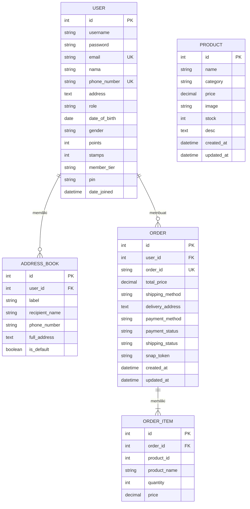
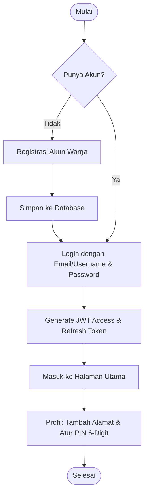
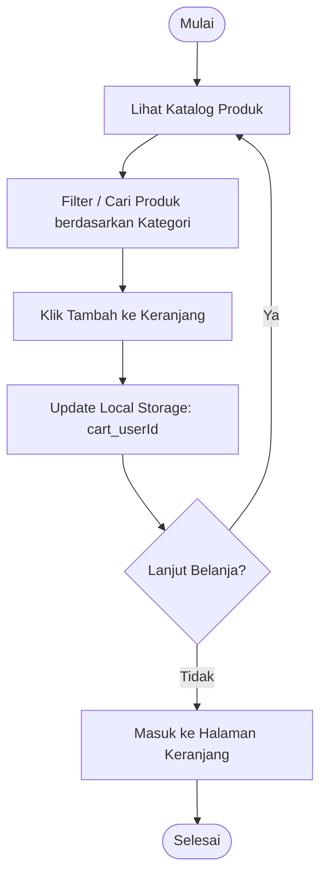
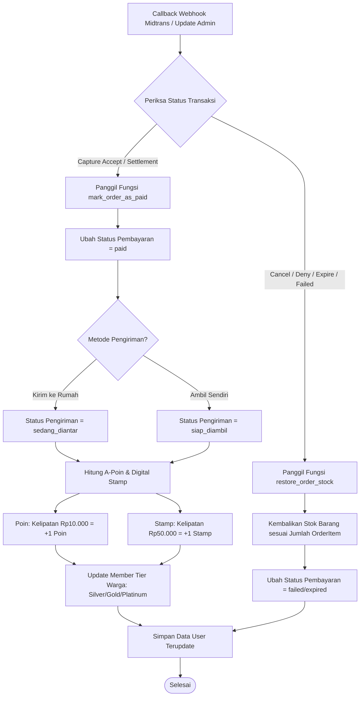

# 🛒 Aplikasi Koperasi RT (KopeRT)

Aplikasi **Koperasi RT (KopeRT)** adalah platform e-commerce dan loyalitas warga berbasis web yang dirancang khusus untuk memfasilitasi transaksi jual beli kebutuhan pokok di tingkat Rukun Tangga (RT). Aplikasi ini mengintegrasikan sistem belanja online, manajemen alamat, sistem poin/stamp loyalitas warga, verifikasi keamanan transaksi menggunakan PIN, serta pembayaran online otomatis menggunakan Midtrans.

---

## 🏗️ Arsitektur Teknologi

Aplikasi ini menggunakan arsitektur **Decoupled Frontend-Backend**:
1. **Backend**:
   - **Framework**: Django 6.0.5 & Django REST Framework (DRF)
   - **Database**: MySQL (`koperasi_rt`)
   - **Autentikasi**: JSON Web Token (JWT) via `django-rest-framework-simplejwt`
   - **Payment Gateway**: Midtrans Sandbox (Snap API & Notification Webhook)
   - **Sistem Loyalitas**: A-Poin & Digital Stamp untuk menentukan tingkatan member (*Silver, Gold, Platinum*)
2. **Frontend**:
   - **Framework**: Next.js (TypeScript) & React
   - **Styling**: Vanilla CSS & TailwindCSS
   - **State & Storage**: Local Storage untuk menyimpan keranjang belanja (*cart*) berdasarkan ID pengguna.

---

## 📊 Entity Relationship Diagram (ERD)

Berikut adalah hubungan antar entitas (tabel database) di dalam sistem:



---

## 🗄️ Struktur Database dan Tabel

Database yang digunakan bernama `koperasi_rt` dengan tabel-tabel utama sebagai berikut:

### 1. Tabel `accounts_user` (Entitas Warga / User)
Tabel ini mewarisi kelas `AbstractUser` dari Django untuk menyimpan profil warga, pengurus (admin), serta informasi loyalitas.

| Nama Kolom | Tipe Data | Keterangan |
| :--- | :--- | :--- |
| `id` | `INT (PK, Auto Increment)` | ID unik pengguna / warga. |
| `username` | `VARCHAR(150, Unique)` | Username untuk login (otomatis diisi email saat registrasi). |
| `password` | `VARCHAR(128)` | Hash kata sandi akun. |
| `email` | `VARCHAR(254, Unique)` | Alamat email unik warga. |
| `nama` | `VARCHAR(150)` | Nama lengkap warga. |
| `phone_number` | `VARCHAR(20, Unique)` | Nomor telepon aktif warga. |
| `address` | `TEXT (Nullable)` | Alamat default warga. |
| `role` | `VARCHAR(10)` | Peran akun (`admin` / `user`). |
| `date_of_birth`| `DATE (Nullable)` | Tanggal lahir warga. |
| `gender` | `VARCHAR(2, Nullable)` | Jenis kelamin (`L` = Laki-laki, `P` = Perempuan). |
| `points` | `INT` | Jumlah akumulasi **A-Poin** (Default: 0). |
| `stamps` | `INT` | Jumlah akumulasi **Stamp Digital** (Default: 0). |
| `member_tier` | `VARCHAR(15)` | Tingkatan member (`silver`, `gold`, `platinum`). |
| `pin` | `VARCHAR(6, Nullable)` | PIN 6-digit keamanan transaksi/COD. |

### 2. Tabel `accounts_addressbook` (Buku Alamat Warga)
Menyimpan daftar alamat pengiriman warga. Setiap warga bisa memiliki lebih dari satu alamat.

| Nama Kolom | Tipe Data | Keterangan |
| :--- | :--- | :--- |
| `id` | `INT (PK, Auto Increment)` | ID unik alamat. |
| `user_id` | `INT (FK)` | Relasi ke `accounts_user.id` (On Delete: Cascade). |
| `label` | `VARCHAR(50)` | Label alamat (misal: "Rumah Utama", "Warung"). |
| `recipient_name`| `VARCHAR(150)` | Nama penerima di alamat tersebut. |
| `phone_number` | `VARCHAR(20)` | Nomor telepon penerima. |
| `full_address` | `TEXT` | Detail alamat pengiriman lengkap. |
| `is_default` | `BOOLEAN` | Menandakan apakah ini alamat utama. |

### 3. Tabel `orders_product` (Katalog Produk Koperasi)
Menyimpan informasi barang yang dijual di koperasi.

| Nama Kolom | Tipe Data | Keterangan |
| :--- | :--- | :--- |
| `id` | `INT (PK, Auto Increment)` | ID unik produk. |
| `name` | `VARCHAR(200)` | Nama barang / produk. |
| `category` | `VARCHAR(100)` | Kategori produk (sembako, kebersihan, ATK, dll.). |
| `price` | `DECIMAL(12, 2)` | Harga jual produk. |
| `image` | `VARCHAR(500)` | Path gambar produk atau emoji representasi visual. |
| `stock` | `INT` | Stok barang yang tersedia di koperasi. |
| `desc` | `TEXT (Nullable)` | Deskripsi/detail spesifikasi produk. |
| `created_at` | `DATETIME` | Waktu produk ditambahkan ke sistem. |
| `updated_at` | `DATETIME` | Waktu data produk diperbarui terakhir kali. |

### 4. Tabel `orders_order` (Transaksi Pesanan)
Menyimpan riwayat transaksi pemesanan yang dilakukan oleh warga.

| Nama Kolom | Tipe Data | Keterangan |
| :--- | :--- | :--- |
| `id` | `INT (PK, Auto Increment)` | ID unik pesanan internal. |
| `user_id` | `INT (FK)` | Relasi ke `accounts_user.id`. |
| `order_id` | `VARCHAR(50, Unique)` | Kode unik pesanan format `KOP-YYYYMMDDHHMMSS-RAND`. |
| `total_price` | `DECIMAL(12, 2)` | Total harga belanja keseluruhan. |
| `shipping_method`| `VARCHAR(20)` | Metode pengiriman (`pickup` / `delivery`). |
| `delivery_address`| `TEXT (Nullable)` | Alamat tujuan pengiriman (jika diantar). |
| `payment_method`| `VARCHAR(20)` | Metode pembayaran (`midtrans` / `cod`). |
| `payment_status`| `VARCHAR(20)` | Status pembayaran (`pending`, `paid`, `failed`, `expired`). |
| `shipping_status`| `VARCHAR(20)` | Status pengiriman (`proses`, `siap_diambil`, `sedang_diantar`, `selesai`). |
| `snap_token` | `VARCHAR(255, Nullable)`| Token transaksi Midtrans untuk checkout. |
| `created_at` | `DATETIME` | Waktu pesanan dibuat. |
| `updated_at` | `DATETIME` | Waktu status pesanan diperbarui. |

### 5. Tabel `orders_orderitem` (Detail Item Pesanan)
Menyimpan rincian produk yang dibeli dalam satu transaksi.

| Nama Kolom | Tipe Data | Keterangan |
| :--- | :--- | :--- |
| `id` | `INT (PK, Auto Increment)` | ID detail item. |
| `order_id` | `INT (FK)` | Relasi ke `orders_order.id`. |
| `product_id` | `INT` | ID produk yang dibeli (referensi statis untuk riwayat). |
| `product_name` | `VARCHAR(150)` | Nama produk saat dibeli. |
| `quantity` | `INT` | Jumlah barang yang dibeli. |
| `price` | `DECIMAL(12, 2)` | Harga satuan produk saat transaksi terjadi. |

---

## 🔄 Alur Program (Program Flow)

Sistem KopeRT memiliki empat alur utama yang diilustrasikan dengan diagram alur di bawah ini:

### 1. Registrasi & Autentikasi Warga
Warga mendaftar dengan email dan nomor telepon, lalu masuk menggunakan JWT token. Di halaman profil, warga dapat mengatur PIN 6-digit untuk verifikasi transaksi COD.



### 2. Belanja & Kelola Keranjang
Warga dapat mencari produk berdasarkan kategori dan menambahkan barang ke keranjang belanja lokal.



### 3. Pemesanan & Pembayaran (Checkout)
Proses checkout memvalidasi stok produk, meminta verifikasi PIN jika memilih COD, dan menghubungi API Midtrans Snap untuk pembayaran online.

```mermaid
flowchart TD
    A[Klik Checkout di Keranjang] --> B{Pilih Metode Pengiriman}
    B -->|Kirim ke Rumah| C[Pilih Alamat dari Address Book]
    B -->|Ambil Sendiri| D[Metode Ambil Sendiri]
    C & D --> E{Pilih Metode Pembayaran}
    
    E -->|Bayar di Tempat - COD| F[Input 6-Digit PIN Transaksi]
    F --> G{Verifikasi PIN Valid?}
    G -- Tidak --> F
    G -- Ya --> H[Kirim Request Order ke Backend]
    
    E -->|Midtrans Online| H
    H --> I[Backend: Validasi Stok Produk]
    I -->|Stok Cukup| J[Kurangi Stok Barang]
    I -->|Stok Kurang| K[Tampilkan Error & Batalkan]
    
    J --> L[Buat Record Order & OrderItem di DB]
    L --> M{Metode Pembayaran?}
    M -->|COD| N[Set snap_token = 'cod']
    M -->|Midtrans| O[Panggil API Midtrans Snap]
    O -->|Berhasil| P[Dapatkan snap_token Midtrans]
    O -->|Gagal/Offline| Q[Gunakan Simulated Token (Resilience)]
    
    N & P & Q --> R[Return Order Detail & Token ke Frontend]
    R --> S{Metode Pembayaran?}
    S -->|COD| T[Tampilkan Halaman Sukses COD]
    S -->|Midtrans| U[Buka Popup Snap Midtrans di Browser]
    U --> V[Warga Melakukan Pembayaran]
    T & V --> W([Selesai])
```

### 4. Pembaruan Status Transaksi & Penghargaan Loyalitas
Sistem memperbarui status pembayaran dan pengiriman berdasarkan callback webhook Midtrans atau modifikasi manual oleh pengurus koperasi di halaman panel admin. Setelah pembayaran diverifikasi (`paid`), warga mendapatkan A-Poin dan Digital Stamp.



---

## 🛡️ Aturan Bisnis Loyalitas & Membership

Loyalitas warga didasarkan pada total belanja per transaksi saat status pembayaran menjadi **Terbayar/Lunas (`paid`)**:
1. **A-Poin**: Setiap kelipatan belanja **Rp10.000** mendapatkan **1 Poin**.
2. **Stamp Digital**: Setiap kelipatan belanja **Rp50.000** mendapatkan **1 Stamp**.
3. **Tingkatan Member (Member Tier)**:
   - **Silver**: Poin akumulatif **< 200 Poin**.
   - **Gold**: Poin akumulatif **200 s.d. 499 Poin**.
   - **Platinum**: Poin akumulatif **>= 500 Poin**.
